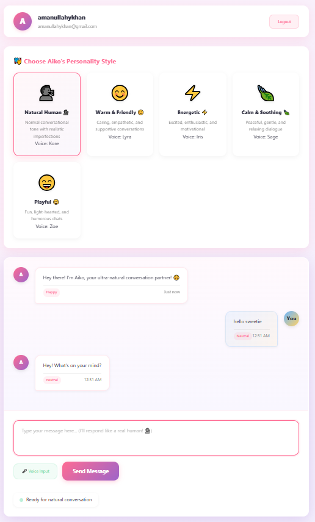

# 🎀 AIKO - Ultra Natural Human-Like Chatbot

<div align="center">


**Experience human-like conversation with studio-quality voice synthesis**

[Features](#-features) • [Demo](#-demo) • [Installation](#-installation) • [Usage](#-usage) • [Voice Styles](#voice-styles) • [API Reference](#-api-reference)

</div>

  


  Link: https://voice-chatbot-project.onrender.com
  

## ✨ **Features**

### 🎙️ **Ultra-Natural Voice**
- **Studio-quality TTS** using Gemini AI (or Web Speech API fallback)
- **5 distinct personality voices** - each with unique vocal characteristics
- **Human-like imperfections** - natural pauses, breaths, and conversational fillers
- **Emotion-aware** responses with matching vocal tones

### 🤖 **Intelligent Conversation**
- **Gemini 2.5 Flash AI** for human-like dialogue
- **Context-aware** - remembers conversation history
- **Emotion detection** - responds appropriately to user sentiment
- **Multi-personality** - switch between different conversation styles

### 🔐 **User Features**
- **Secure authentication** with session management
- **Separate chat histories** for each user
- **Voice preferences** - customize speech rate, pitch, and style
- **Voice input** - speak instead of type

### 🎨 **Beautiful Interface**
- **Anime-inspired UI** with smooth animations
- **Responsive design** works on desktop and mobile
- **Real-time status** indicators
- **Emotion badges** on messages

## 🚀 **Quick Start**

### **Prerequisites**
- Python 3.8 or higher
- Modern web browser with Web Speech API support
- (Optional) Gemini API key for premium voice quality

### **Installation in 3 Steps**

```bash
# 1. Clone the repository
git clone https://github.com/amanullahykhan/aiko-chatbot-project.git
cd aiko-chatbot

# 2. Install dependencies
pip install flask google-genai

# 3. Run the chatbot
python app.py
